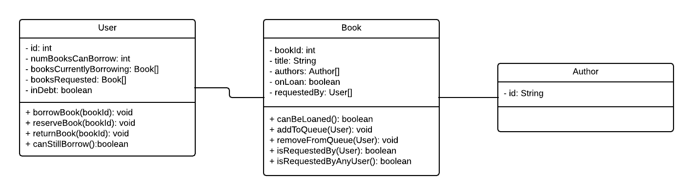
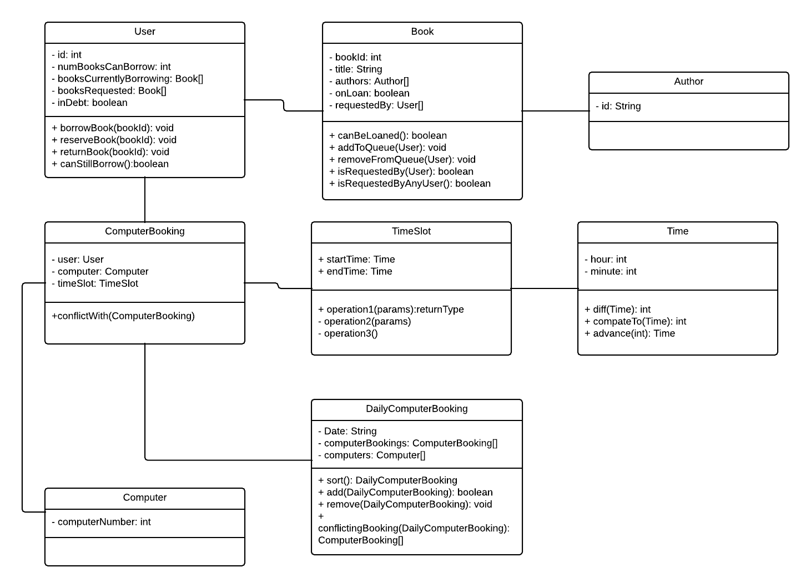

# Assignment Ideas <!-- omit in toc -->

- [Hangman](#hangman)
- [Library Booking System](#library-booking-system)
- [Ceasar Cipher](#ceasar-cipher)
- [Grading System](#grading-system)
- [Travelling tourist system](#travelling-tourist-system)
- [Bill management and purchases](#bill-management-and-purchases)
- [Apartment rental](#apartment-rental)
- [Card Game](#card-game)
- [Gitignore Combiner](#gitignore-combiner)
- [Treasure Hunt](#treasure-hunt)
- [TV Show Scheduling](#tv-show-scheduling)

## Hangman

Implement the classic word game Hangman. Each instance of the Hangman class is one hangman game.

The words will be from a text file which we will provide. We provide helper method to read the text file and return one of the words from that file we will also handle the user input and validation of user input. We can require the students to deal with the stored results.

## Library Booking System

Develop a prototype booking system for the library. The first prototype will be a simple system consisting of three classes.

- Book
- Author
- User

The `Book` class will contain information of the book, such the title and authors. It will contain information, such as whether it has been loaned out and also the queue of users that have request this book.

 The `User` class will contain information of the user such as the unique id and the list of books that the user have currently borrowed and another list which the books that the user have request for borrowing. A user can at most borrow 5 books at time. We will omit detail such as duration of the loan for simplicty.

 Below is a sample class diagram:

This problem can also be extended by implementing the daily computer booking system, similar to 2018S2 assignment 2:

## Ceasar Cipher

Implement the Caesar Cipher, which is to encrypt a message by shifting every letter of that message by a number.

## Grading System

A gradebook system intended to keep track of students overall mark of the unit out of 100. Assignments are markked out of X but are contribute to Y out of the 100 in the unit. The system is intended to convert the assignment mark to the unit mark and ensure all the assignment marks add up to 100.

## Travelling tourist system

Scenario: Bob is going on a holiday and has chosen the places that he wants to visit. He has many things that he would like to do, however for each place that he will visit, he can only stay there for a limited amount of time, therefore he listed the things he wanted to do, along with their priority in his list and have now approach you asking for help. Bob would like a list that contains all the things that he should do for each place that he is visiting, according to the time restriction and priorites that Bob has given. Your task is to implement a system according to Bob requirements.

## Bill management and purchases

Implement a system that manage your monthly bills and purchases. Given the monthly income, and the monthly list of bills for the month and the purchases you want to make, such as haircut or a new entertainment device along with the priorites of the purchases. Calculate what purchases can be made after all the bills are paid. If there is not enough money for the bills, give out a warning.

## Apartment rental

A interval scheduling problem that could be solved using the greedy approach.

Scenario: As a home owner you are planning to rent out your apartment for short-term accomodation like AirBnb. You have a list of people that are interested in renting out your apartment along with the number of days they are staying. Your goal is to maximise the number of days your apartment is rented out, as a aspiring software engineer, you have decided to implement a system that will solve this problem for you.

## Card Game

Imeplment a standard deck of cards and then implement a simple card game.

## Gitignore Combiner

Implement a program that combines text files together, similar to the Unix program `cat`.

## Treasure Hunt

A fractional knapsack problem that could be solved using the greedy approach.

Scenario: You are a treasure hunter and you have come across a island filled with treasure. As you come treasure trove, you also see a sign that says 'these treasures only come once, choose carefully'. You interpret that you might not able to visit this island again and encounter this treasure trove. Although you are unsure whether the sign is true or not, you have decide to not risk it and try to get the most valued item and put it back into your ship and take it back home. You have decided to write a software that will help you solve this problem.

## TV Show Scheduling

Scenario: You are going to your friends house next weekend to watch TV shows, there are many shows that day that you two would like to watch, you and your friend have listed the shows for that day and given each show a number. The lower the number, the more important that show is. Your task is to implement a program that returns a schedule.